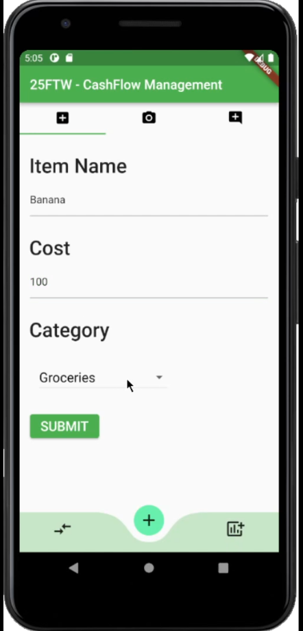
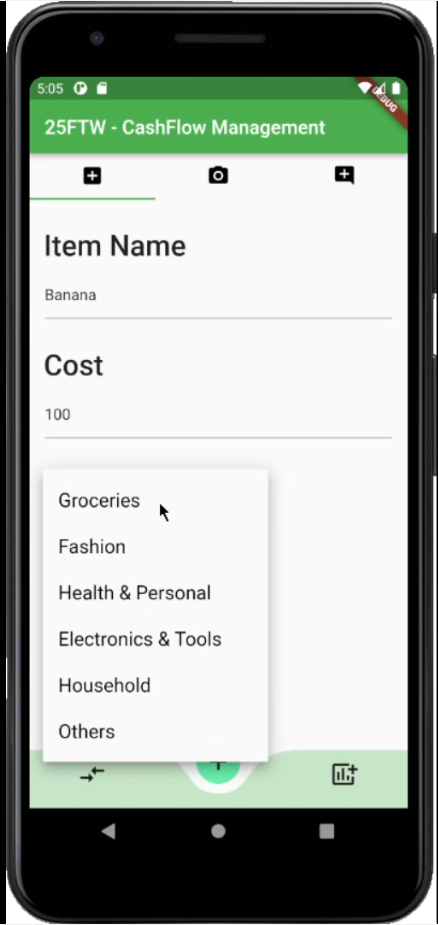
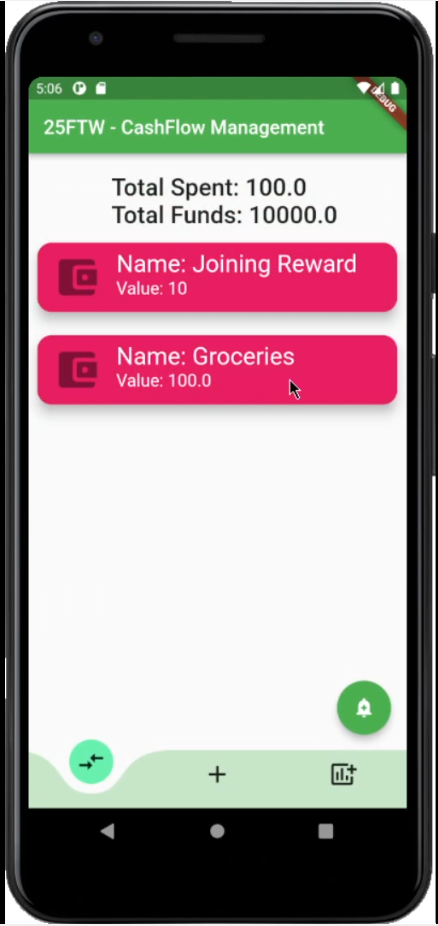
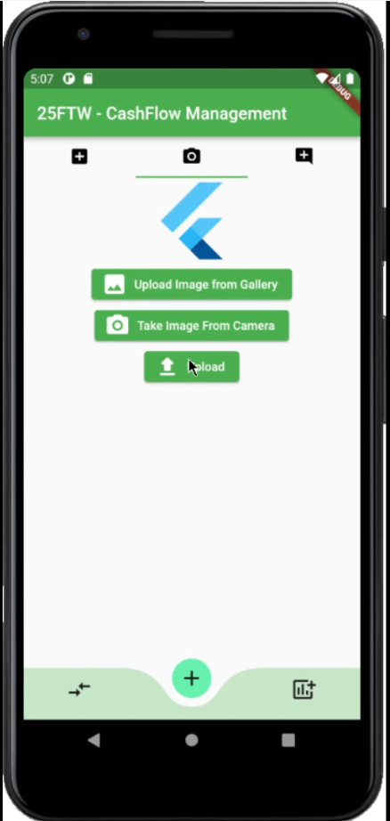
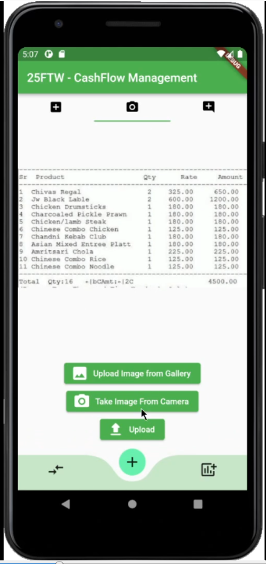
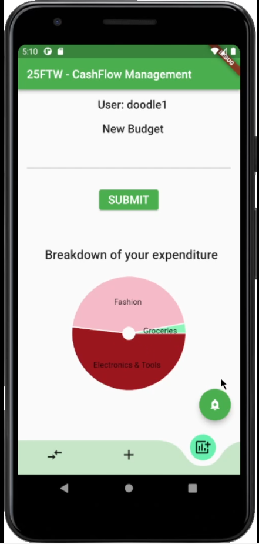
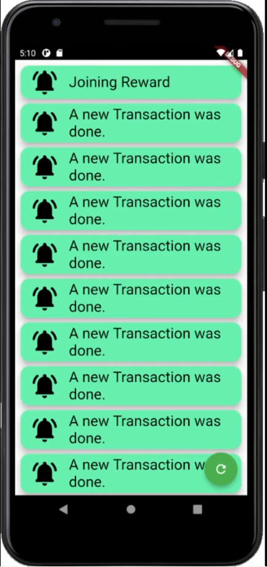
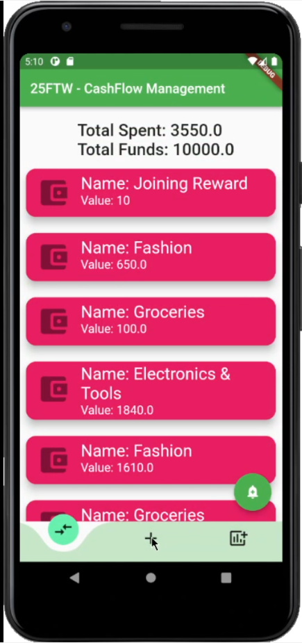

# CashFlow Management

This is the application made by Team 25FTW for the Bugsquash 2022 competition.

Team Members:
1. Anandteertha Rao. BE CE.
2. Shabarish Ramaswamy. BE CE.
3. Shlok Vivek Naik. BE CE.

 

# Overview

This project is an Application, both for Android as well as for IOS for managing your cashflow.

 

# Demo
## Screenshots

 

Main Page.

 

Add New Page with Options for Categories.

 

Transactions Page reflects the added item.

 

Add New transaction via Image.
Image can be from Camera or using Device Storage.

 

Upload the Image to the Backend.

 

The Visualization of the Transaction Data.

 

Realtime Notification from the backend.

 

Updates Transactions Page.

## Thank you.
`- Team 25FTW.`